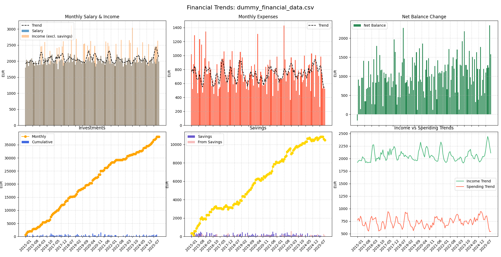
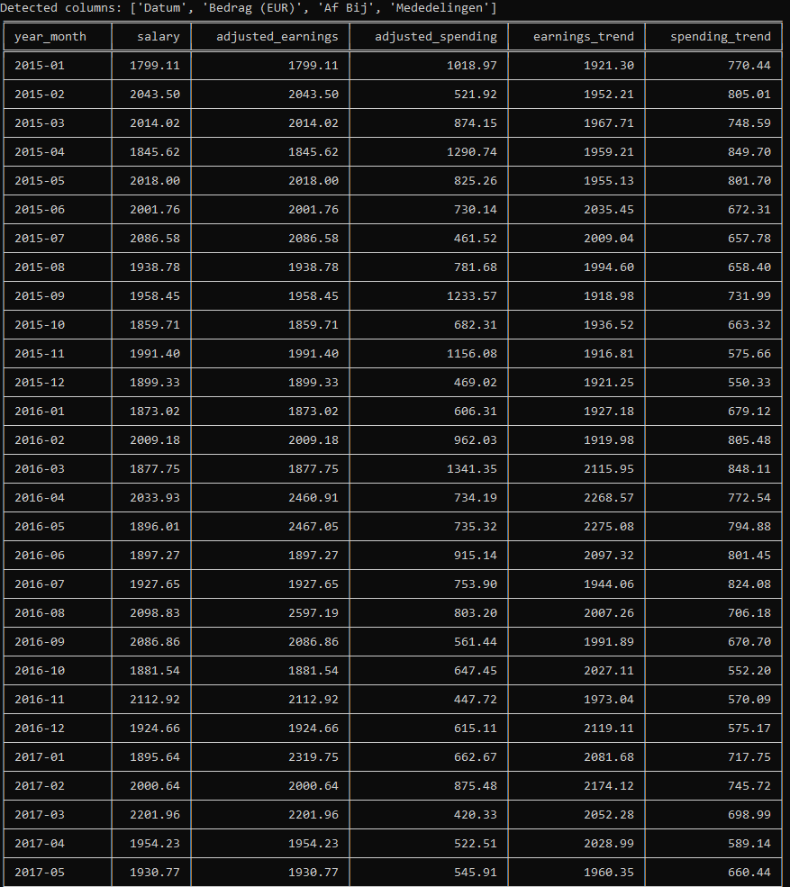

# ING Bank Financial Analyzer

A Python tool to analyze and visualize financial data exported from **ING Bank** in CSV format. Includes a dummy data generator for testing and demonstration purposes.

---

### Example Visualization Output

  
*Example plot generated by the analyzer script*

---

### Example Command Line Output

  
*Example of the analyzer script output in the terminal*

---

## Features

- Parses **ING Bank** CSV exports with semicolon separators, supporting multiple possible column names  
- Calculates monthly salary, spending, earnings, savings, and investments  
- Detects financial trends with rolling smoothing and outlier handling  
- Generates clear and informative visualizations for easy financial insight  
- Includes a dummy CSV data generator for testing or demoing the analyzer  
- Tracks payments to and from investment and savings accounts. Note, any profit or interest is not tracked!
---

## About the CSV File

This tool is designed to process CSV files downloaded from **ING Bank** online banking. The CSV must have semicolon (`;`) separators and come from your **payment account** (Dutch: *Betaalrekening*).

To download the CSV from **ING Bank**, log in to your online banking portal and navigate to:

- **"Afschriften en overzichten"** (Statements and overviews)  
- Then **"Af- en bijschrijvingen downloaden"** (Download debit and credit transactions)  

When prompted, **select your Betaalrekening (payment account)** as the account to download. You can choose the largest time span available to analyze a comprehensive dataset.

Please note that **ING Bank's online environment may change over time**, so exact menu names or navigation steps could differ slightly. The instructions above are a guideline.

---

## Compatibility and Contributions

While this tool is specifically tested with **ING Bank** CSV exports, it *may* work with CSV files from other banks if they use similar formatting and column names. However, this is **untested**.

If you encounter any issues or want to support additional banks or CSV formats, please feel free to:

- Open an **issue** describing the problem or feature request  
- Submit a **pull request** with improvements or fixes  

This project is open-source and welcomes community contributions!

---

## Usage

### Financial Analyzer

```bash
python ing_financial_analyzer.py path/to/your_ING_bank_export.csv
```

### Dummy Data Generator

```bash
python dummy_csv_data_generator.py
```

## Install dependencies:

See requirements.txt in the root of this repo. These Python packages can be installed with:

```bash
pip install package_name
OR
python -m pip install package_name
```